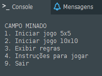
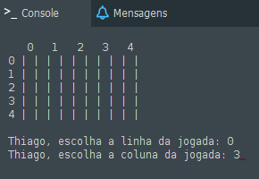
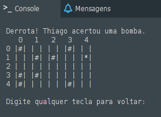

# Minesweeper
Computer Science activity, first semester.
Made in Portugol, a brazilian programming pseudolanguage.

(Text in Portuguese past this point)

Jogo para duas pessoas, pelo console do Portugol. Possui dois tamanhos de tabuleiro. Diferente do convencional, este campo minado é uma versão simplificada do jogo, em que os jogadores não possuem dicas em relação a posição das bombas. Logo, o vencedor é quem acertar a sorte e conseguir evitar as bombas.

Após inserir o nome de cada jogador, cada um escolhe uma linha e uma coluna por vez para jogar.

Casas vazias aparecem com o símbolo "#", e bombas com "*".
